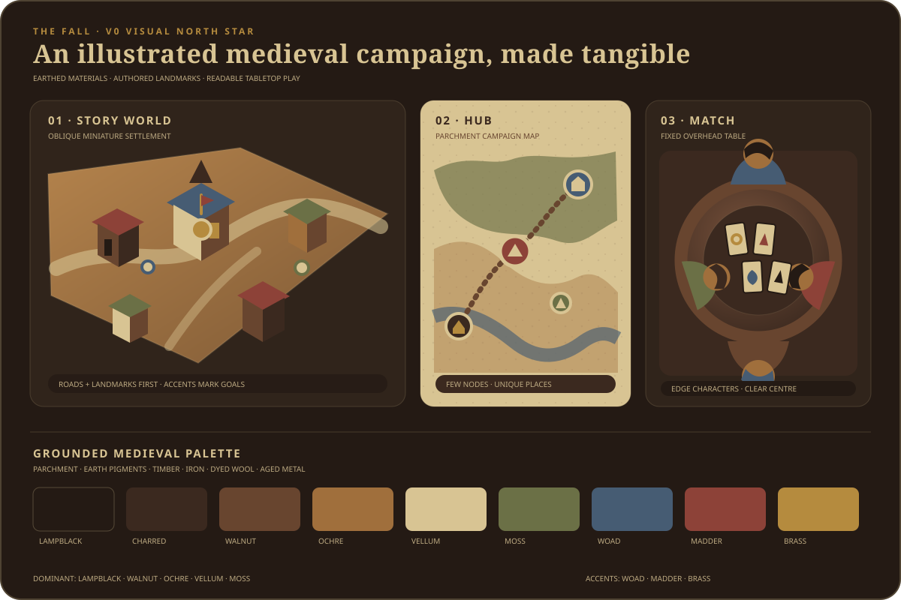

# Art Direction

Status: V0 working brief

## Direction in one sentence

**Confirmed:** The Fall is a warm, stylized medieval-cartoon card game staged like a readable tabletop diorama in an original, culturally neutral world.

At gameplay distance, the player should read the cards first, the active character and action second, and the room last. Shape, value, and motion carry meaning before surface detail does.

## Decision boundary

The following directions are already confirmed and must not be reopened by a prototype:

- stylized, cartoonish, medieval visual direction
- an original fictional setting that does not claim a specific real-world culture
- expressive upper-body characters around the table
- a completely stationary elevated gameplay camera
- landscape and portrait mobile compositions plus desktop layouts
- inexpensive or generated assets until the direction is proven

Everything labelled as a **V0 target** in this document is a working constraint for comparing prototypes. It may be revised from evidence gathered by the table-composition, asset-pipeline, animation, or platform-validation issues. It is not a production-content commitment.

## Visual principles

### 1. Readable miniature stage

- Compose broad shapes that survive the fixed overhead view and a phone-sized frame.
- Use silhouettes, value groups, and restrained color blocking before texture detail.
- Keep the play surface quieter and darker than card faces.
- Reserve the highest local contrast for ranks, suits, active-turn cues, and resolved scoring events.

### 2. Crafted, not historical

- Suggest hand-shaped wood, hammered metal, woven cloth, ink, and painted card through simplified planes and controlled wear.
- Exaggerate useful construction features—rounded corners, thick rims, large clasps, broad cuffs—without reproducing a particular historical object or costume.
- Prefer authored asymmetry and a few large imperfections over noisy procedural damage.

### 3. Warm competition

- The baseline mood is welcoming and social with room for theatrical competitive peaks.
- Characters may be proud, sly, focused, amused, or surprised; hostility and menace are not the default.
- Gameplay escalation comes from pose, timing, light, sound, and VFX rather than camera motion or visual violence.

### 4. Exaggeration with restraint

- Stylize proportions enough to clarify faces, hands, and poses, but keep characters out of chibi or bobble-head territory.
- Use one dominant, one supporting, and at most one accent shape per asset.
- Let hero details reinforce an asset's function; remove details that collapse into noise at gameplay distance.

### 5. One hierarchy across platforms

- Preserve the same priority order in portrait, landscape, and desktop compositions.
- UI and world-space cues may recompose, but semantic color and shape meanings remain stable.
- Never rely on color alone for turn, team, score, validity, or selection state.

## Shape language

| Family | Primary shapes | Intended read | Avoid |
| --- | --- | --- | --- |
| Characters | soft triangles, arches, offset circles | expressive, approachable, distinct | identical torsos, needle-thin limbs, silhouette-breaking clutter |
| Table and room | broad circles, rounded rectangles, chunky supports | stable stage, handmade construction | sharp modern minimalism, Gothic spikes, dense carved patterns |
| Cards | crisp rectangle, generous border, large repeated pips | fastest and cleanest information layer | distressed faces, weak corner marks, ornate low-contrast borders |
| UI | shallow arches, clipped corners, layered parchment/wood planes | compact crafted frame | tiny filigree, fake heraldry, large opaque panels over play |
| VFX | arcs, rings, short trails, expanding stamps | traceable cause and result | persistent fog, full-screen noise, camera shake, uncontrolled particles |

## Working palette and value hierarchy

The palette is a starting relationship, not a final material library. Variants must retain luminance separation when viewed in grayscale.

| Role | Color | Hex | Usage |
| --- | --- | --- | --- |
| Deep neutral | charcoal plum | `#28232B` | deepest room values, separation |
| Play surface | smoked oak | `#574133` | table and large background masses |
| Warm base | toasted clay | `#A8623C` | wood, leather, warm costume blocks |
| Light base | parchment | `#E7D6B0` | cards, focused UI surfaces, readable labels |
| Cool balance | muted teal | `#3E7774` | cloth, secondary costume families, cool fill |
| Action accent | ember coral | `#D95D45` | urgent emphasis, not the sole invalid/error cue |
| Reward accent | old gold | `#D6A84F` | score and celebration highlights used sparingly |

Keep most of the frame in the deep-neutral, oak, clay, and teal families. Parchment and gold are scarce enough to pull attention. Suit identities will require their own tested combination of icon shape, border treatment, and color; this brief does not assign color-only suit meanings.

## Character treatment from the gameplay camera

Characters are authored as complete upper-body presentation assets: head, neck, torso to below the rib cage, shoulders, arms, and hands. The table may hide the lower cutoff, but the mesh must not look like a floating bust when leaning or gesturing.

### Silhouette rules

- Head, shoulder line, near hand, and far hand remain separable in the default seated pose.
- Each cast member gets a distinct shoulder width, head/hair contour, and one restrained signature shape.
- Hands are slightly enlarged for gesture readability; fingers may be simplified into clear grouped forms.
- Hair, hats, collars, and shoulder pieces must not hide the eyes or merge the head into the torso from above.
- Avoid important identity details only on the chest front; the camera may barely see them.

### Face and pose rules

- Eyes, brows, mouth corners, and head tilt carry the primary expression.
- The neutral seated pose leaves both hands available for card interaction and reactions.
- Prototype expression coverage: neutral, focused, pleased, surprised, and disappointed.
- Prototype pose coverage: idle, active-turn attention, play-card reach, capture reaction, and celebration.
- Extreme poses must remain inside the authored seat envelope and must not cover the local hand or central cards.

### V0 readability checks

- At a 64-pixel on-screen head height, the expression family remains distinguishable.
- At 25% screenshot scale, the character silhouette remains distinguishable from the chair and room.
- A grayscale view preserves separation between skin/hair, head/shoulders, and character/background.
- A top-camera turntable exposes no silhouette collapse in the expected seated motion range.

These are comparison tests, not launch accessibility thresholds.

## Table, room, props, and materials

- The table is the stable compositional anchor and must support 1v1, three-player, and 2v2 without built-in seat markings.
- The central play field uses low-frequency grain and restrained roughness so cards do not disappear into the material.
- Room edges frame the table with large architectural masses; shelves, beams, vessels, and textiles stay below the gameplay contrast range.
- Props tell a fictional craft-and-hospitality story, not a specific national, religious, military, or dynastic history.
- Surface wear clusters at plausible contact areas. Do not apply equal scratches, edge wear, or grunge everywhere.
- Use a mostly opaque material stack. Transparency, layered clear coats, screen-space effects, and parallax are exceptions that require a measured benefit.

## Lighting

- Start with a warm, broad key from above and one restrained cool fill for silhouette separation.
- Keep card faces close enough to neutral that suit and rank colors are not shifted beyond recognition.
- Prefer baked or otherwise inexpensive room contribution; reserve real-time shadowing for the smallest useful set of dynamic subjects.
- Avoid crushed black faces, hot card glare, flickering practical lights, and colored lighting that becomes a gameplay code.
- Gameplay emphasis uses local light, material response, and VFX—not camera movement.

## UI and VFX

### UI

- Use a plain, highly legible text face for scores, names, and actions; decorative lettering is limited to large non-critical headings.
- Frames use the world palette and shape language but remain thinner and calmer than the cards they support.
- State cues combine at least two channels such as icon/shape, value, motion, outline, or text.
- Allow localization expansion and pseudo-localized testing from the first authored layout.

### VFX

- Every effect begins at its cause and leads the eye to its result.
- A normal capture is brief and directional; a cascade adds countable steps; a Fall adds one unmistakable impact beat; a clean table ends with a clear empty-table confirmation.
- VFX must not obscure ranks, hide the next required decision, or depend on camera shake.
- Reduced-motion and fast-forward variants should be achievable by shortening travel and particle duration without removing the result cue.

## Cultural-neutrality constraints

"Culturally neutral" means an original fictional synthesis, not an empty world and not a collage of recognizable cultures.

### Required

- Build designs from generic function and project-owned shape language before adding decoration.
- Use invented, non-linguistic geometric motifs only after checking that they do not closely reproduce protected, sacred, political, national, or institutional symbols.
- Vary body type, age, skin tone, facial structure, hair, and temperament across the cast without tying those traits to moral alignment, social class, or game ability.
- Treat suit names and established canto names as game terminology; do not turn them into claims that the fictional setting represents a real culture.
- Record reference origin and the specific property being studied, so a generation prompt does not silently merge an entire source culture into an asset.

### Reject

- real flags, coats of arms, religious marks, readable historical scripts, or copied insignia
- a costume or building that can be identified as a direct reconstruction of one people, period, or place
- stereotyped accents, facial exaggeration, skin-tone coding, or "primitive/exotic" shorthand
- random mixing of sacred or culturally specific motifs because they look medieval or fantasy-like
- use of a living artist's name as a generation style prompt

When uncertain, remove the identifying motif and record the question for review instead of guessing.

## Anti-goals

- photorealism or physically exact historical reconstruction
- grimdark horror, gore, oppressive dirt, or universally hostile expressions
- chibi bodies, oversized bobble heads, or toy-plastic surfaces
- a muddy all-brown frame with no value or temperature hierarchy
- excessive micro-detail, filigree, scratches, decals, or texture noise
- glossy card faces, mirror-like tables, or uncontrolled bloom that harms readability
- tiny medieval-display type for gameplay information
- visual states distinguished only by red/green or by subtle hue shifts
- camera pans, zooms, shake, or depth-of-field changes during gameplay
- direct imitation of a named commercial property, living artist, branded deck, or reference image

## V0 prototype technical envelope

These conservative starting budgets make generated work cheap to compare. Issue #10 will replace them with measured device-tier targets; issue #8 records actual import results.

| Asset | Geometry target | Materials/textures | Rig or runtime target |
| --- | --- | --- | --- |
| Upper-body character | LOD0 at or below 25k rendered triangles; LOD1 at or below 12k; LOD2 at or below 5k | preferably 1, at most 2 materials; one 1024 px texture set in prototype | one skinned renderer preferred; at most 55 deform bones; at most 4 weights per vertex |
| Representative table | LOD0 at or below 12k triangles; LOD1 at or below 6k | at most 2 materials; 1024 px default, 2048 px only if a close readability test proves value | static mesh; colliders simpler than render geometry |
| Single card | at or below 100 triangles including bevel and thickness | one shared material path; 512 x 1024 px working face; mipmaps for world rendering | no rig; pivot centered; no per-card shader variant |
| Small room prop | at or below 3k triangles | one shared/atlased material preferred; 512 px default | static unless interaction requires otherwise |
| One gameplay VFX beat | measure rather than approve by particle count alone; start below 100 simultaneously visible particles | one small atlas and additive/translucent overdraw kept local | pool repeated emitters; no gameplay-state ownership |

Common Unity import assumptions:

- one Unity unit equals one metre; author scale and forward/up axes consistently
- prefer FBX or glTF interchange candidates, with the final pipeline decision owned by issue #8
- generate lightmap UVs only for assets that will use baked lighting; preserve clean primary UVs
- enable mipmaps and platform-appropriate texture compression for world textures
- disable Read/Write when runtime mesh access is unnecessary
- test mesh compression visually instead of assuming its highest setting is safe
- reuse URP-compatible opaque Simple Lit or Baked Lit materials where the style permits
- keep real-time lights, shadow casters, transparent layers, and unique materials scarce
- profile the full representative composition; passing an isolated asset budget does not prove scene performance

See the [annotated visual reference board](visual-reference-board.md), [prototype asset briefs](../assets/prototype-briefs.md), [asset strategy](../assets/strategy.md), and [platform requirements](../technical/platforms.md).
